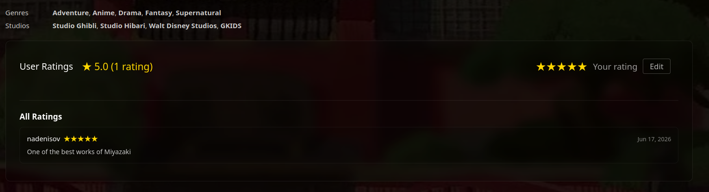
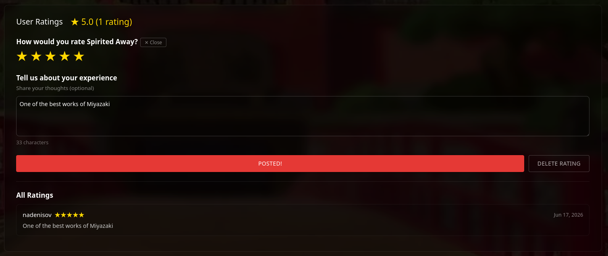
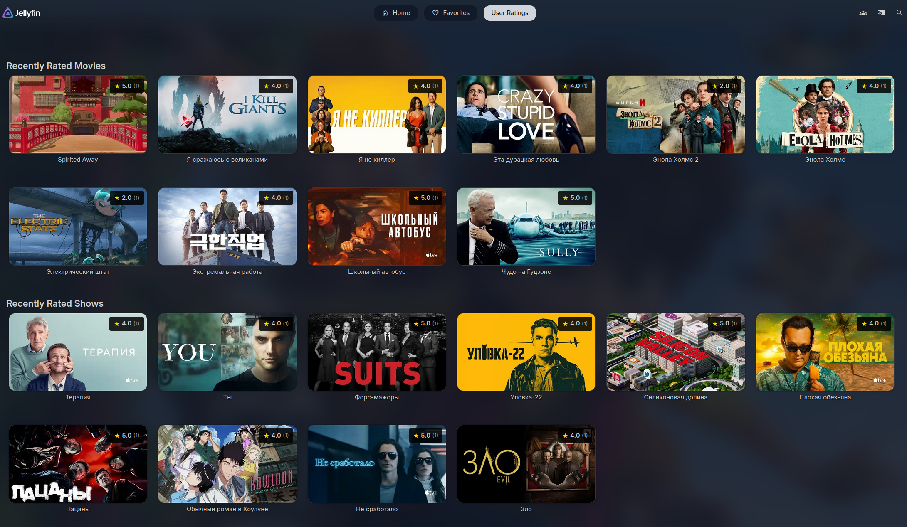
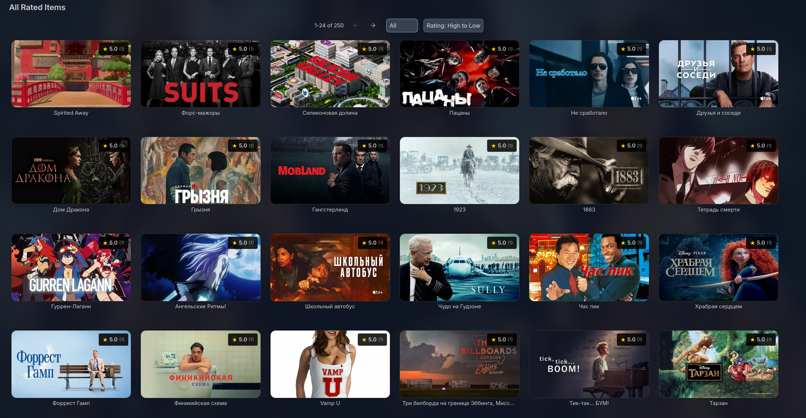
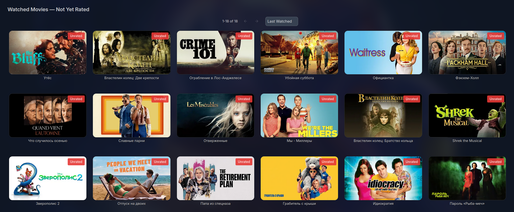
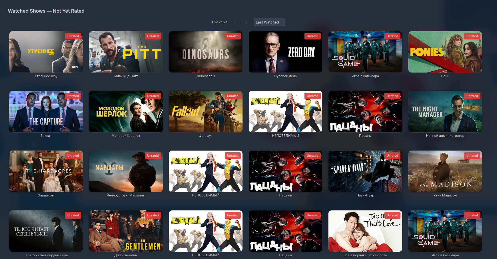
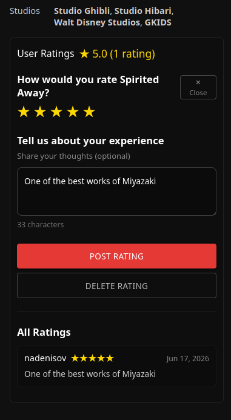
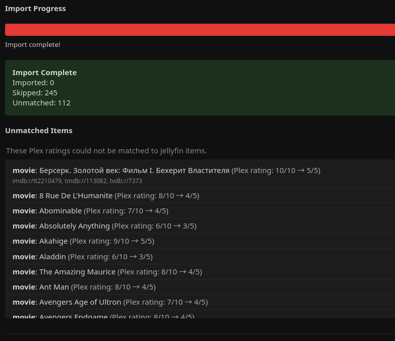
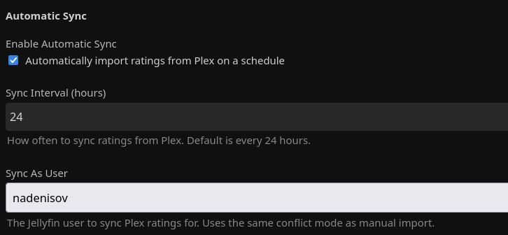

# Jellyfin User Ratings Plugin

**Rate and review content with other users on your Jellyfin server**

[](https://opensource.org/licenses/MIT)
[](https://jellyfin.org/)

A social rating system for Jellyfin that lets users rate movies, TV shows, and episodes, then browse and discover what other users on the server think. Includes Plex rating import with scheduled auto-sync.

> **Note:** Currently supports **web UI only**.

---

## Screenshots

### Rating Items (collapsed)


### Rating Items (expanded)


### Viewer Ratings — Recently Rated


### Viewer Ratings — All Rated Items (with type filter)


### Viewer Ratings — Unrated Movies


### Viewer Ratings — Unrated Shows


### Mobile Support


### Plex Import Settings


### Plex Import Progress


### Plex Scheduled Sync


---

## Features

- ⭐ Rate any content 1-5 stars
- 👥 See ratings from other users on your server
- 📊 Average ratings displayed automatically with total rating counts
- 💬 Optional notes/comments with ratings
- 📺 Works on movies, TV shows, and episodes
- 🎬 **Viewer Ratings Page** - Dedicated browsing interface with:
  - 📋 Recently Rated sections (Movies, Shows, Episodes)
  - 🎞️ **Unrated Watched Items** — find content you've watched but haven't rated yet
  - 🔢 Paginated "All Rated Items" view (24 items per page)
  - 🔄 8 sorting options for rated items: Rating (High/Low), Title (A-Z/Z-A), Recently/Oldest Rated, Most/Least Ratings
  - 📊 4 sorting options for unrated items: Last Watched, Oldest Watched, Title A-Z, Title Z-A
  - 🎛️ Type filter for "All Rated Items": All / Movies / Shows / Episodes
  - ⚙️ Configurable limit for recently rated items (5-50)
  - 🖼️ Native Jellyfin card styling with clickable navigation
  - 🖼️ Smart image fallback: Thumb → Backdrop → Primary (always shows something)
  - ⚡ Independent section loading — Movies render instantly without waiting for Series
- 🌐 Web interface support (desktop & mobile browsers)
- 🔄 **Plex Rating Import** - Import your existing Plex ratings into Jellyfin
  - 🔁 **Scheduled Auto-Sync** - Automatically sync ratings from Plex on a schedule
  - 🔒 AES-256-CBC encrypted Plex token storage
  - 📊 Real-time progress tracking during import

## What's New

See [CHANGELOG.md](CHANGELOG.md) for the full version history.

## Installation

1. Open **Jellyfin Dashboard** → **Plugins** → **Repositories**
2. Add repository URL:
   ```
   https://raw.githubusercontent.com/illmouse/Jellyfin.Plugin.UserRating/main/manifest.json
   ```
3. Go to **Catalog**, find **User Ratings**, and install
4. Restart Jellyfin

## Setup

**No setup required for ratings!** After installing and restarting Jellyfin, the ratings UI will automatically appear on item detail pages when accessing Jellyfin through a web browser.

For Plex import, see [Plex Rating Import](#plex-rating-import) below.

## Usage

### Rating Items

1. Open Jellyfin in a **web browser** (desktop or mobile)
2. Navigate to any **movie, TV show, or episode** detail page
3. Scroll down - the **User Ratings** section appears at the bottom
4. **Rate with 1-5 stars** by clicking the stars
5. Optionally **add a note** to share your thoughts
6. Click **Save Rating**
7. See **all ratings** from other users below your rating!

### Browsing Ratings (Viewer Ratings Page)

1. Go to **Dashboard** → **Plugins** → **User Ratings** → **View Ratings** tab
2. Browse **Recently Rated** sections for Movies, Shows, and Episodes
3. Check **Unrated Watched Items** to find content you've watched but haven't rated
4. Scroll to **All Rated Items** for the complete paginated list
5. Use the **type filter** to show only Movies, Shows, or Episodes
6. Use the **sort dropdown** to sort by:
   - **Rated items:** Rating (High/Low), Title (A-Z/Z-A), Recently/Oldest Rated, Most/Least Ratings
   - **Unrated items:** Last Watched, Oldest Watched, Title A-Z, Title Z-A
7. Click any card to navigate to that item's detail page

### Rating Features

- ⭐ **Your rating** - visible stars you can click to change
- 📝 **Optional notes** - add comments with your rating
- 👥 **Other users' ratings** - see everyone's ratings and notes
- 📊 **Average rating** - calculated automatically
- 🗑️ **Delete rating** - remove your rating anytime

## Configuration

**Dashboard** → **Plugins** → **User Ratings** → **Settings**

### General Settings

- **Recently Rated Items Count** (5-50, default: 10)
  - Controls how many items appear in each "Recently Rated" section (Movies, Shows, Episodes)
  - The "All Rated Items" section remains paginated at 24 items per page

### Plex Rating Import

Import your existing ratings from a Plex Media Server into Jellyfin.

#### Prerequisites

1. Your Plex server must be accessible from the Jellyfin server (IP/hostname + port)
2. You need a Plex authentication token (see below)

#### Getting Your Plex Token

1. Open Plex in a browser and sign in
2. Browse to any library item
3. Click the three dots (⋮) → **Get Info** → **View XML**
4. In the URL, find `&X-Plex-Token=YOUR_TOKEN_HERE` — copy that token value

#### Import Settings

- **Plex Server URL** - Address of your Plex server (e.g., `http://192.168.1.100:32400`)
- **Plex Token** - Your Plex authentication token (stored encrypted using AES-256-CBC)
- **Import Ratings As User** - Which Jellyfin user receives the imported ratings
- **Conflict Mode** - What to do when a rating already exists:
  - **Skip** (default) - Keep the existing rating, don't overwrite
  - **Overwrite** - Replace the existing rating with the Plex rating
  - **Keep Higher** - Keep whichever rating is higher

#### Running a Manual Import

1. Configure the Plex server URL and token
2. Select the target Jellyfin user
3. Click **Import Ratings from Plex**
4. Watch the real-time progress bar — you'll see matched/unmatched/skipped counts

> **Note:** Series-level ratings are imported (Plex `type="show"`). Individual episode ratings are skipped.

### Automatic Sync

Enable scheduled auto-sync to keep your Jellyfin ratings up to date with Plex automatically.

- **Enable Automatic Sync** - Toggle scheduled Plex rating imports
- **Sync Interval (hours)** - How often to run (default: 24 hours)
- **Sync As User** - Which Jellyfin user to sync ratings for

When enabled, Jellyfin's built-in scheduled task system will run the import at the configured interval using the same conflict mode as manual import.

> **Note:** The sync interval takes effect after restarting Jellyfin or manually triggering the scheduled task from Dashboard → Scheduled Tasks.

#### How It Works

1. Connects to your Plex server and fetches all rated items
2. Matches Plex items to Jellyfin items using provider IDs (IMDB → TMDB → TVDB)
3. Converts Plex's 10-point rating scale to Jellyfin's 5-star scale (`round(plexRating / 2)`)
4. Applies your chosen conflict mode for existing ratings
5. Saves all ratings in bulk

#### Troubleshooting

- **"Connection failed"** - Verify the Plex server URL is reachable from the Jellyfin server
- **"Authentication failed"** - Your Plex token may have expired; generate a new one
- **Items showing as "Unmatched"** - The Plex item doesn't have a provider ID (IMDB/TMDB/TVDB) that matches any Jellyfin item. Ensure metadata is fetched for both libraries.
- **SSE progress not updating** - Some browsers/proxies may buffer Server-Sent Events. The import still runs server-side; refresh the page to see results.

## Use Cases

**Family Server**
- Browse the Viewer Ratings page to see what family members are watching and enjoying
- Check ratings before picking your next movie night selection
- See trending content based on recent ratings
- Find content you've watched but haven't rated yet
- Import ratings from a shared Plex server

**Friend Group**
- Discover highly-rated content through the sorted "All Rated Items" view
- Track what everyone's been watching in the Recently Rated sections
- Compare opinions: "Dad rated Breaking Bad 5 stars, Mom gave it 3 stars"
- Share detailed thoughts with optional rating notes

**Plex Migrant**
- Import your existing Plex ratings when moving to Jellyfin
- Set up auto-sync to keep both servers in sync during a transition period

## License

MIT License - see [LICENSE](LICENSE) file for details.

---

Made for the Jellyfin community