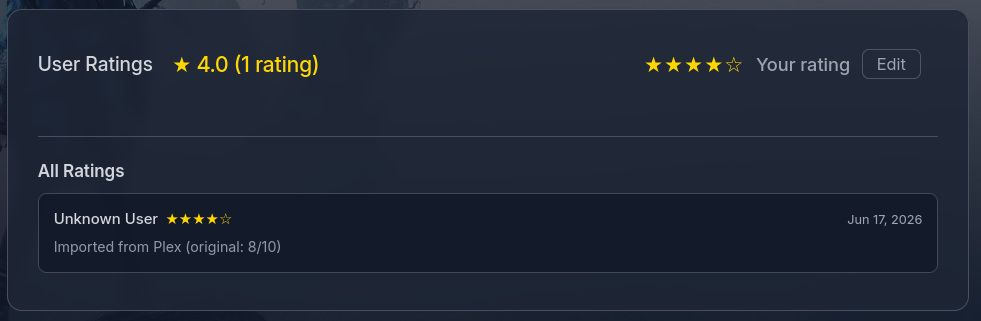
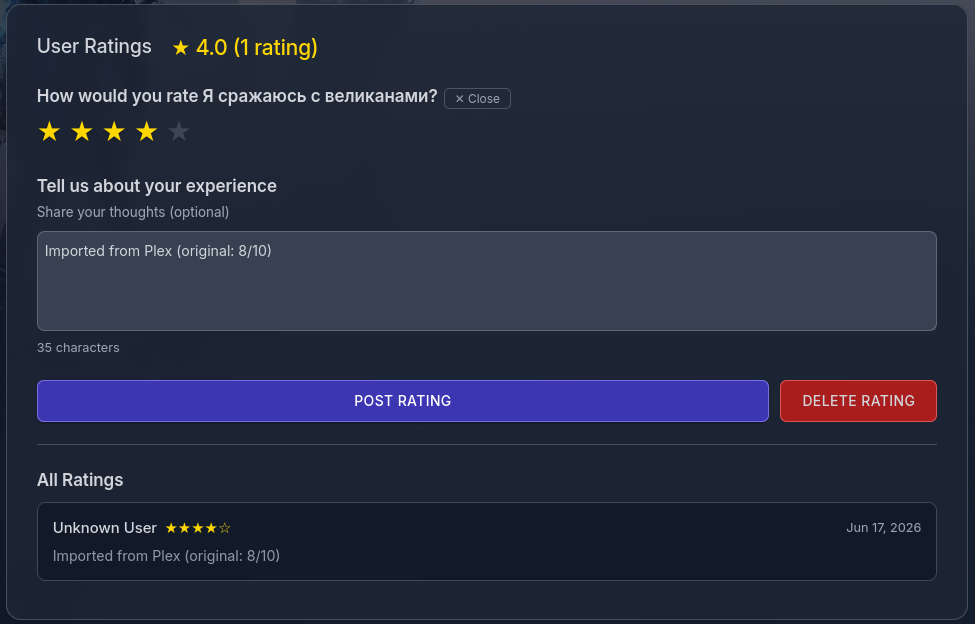
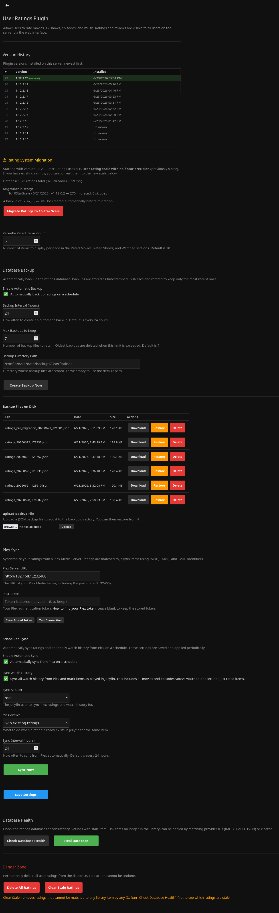
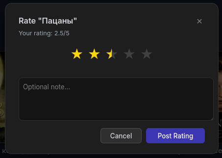
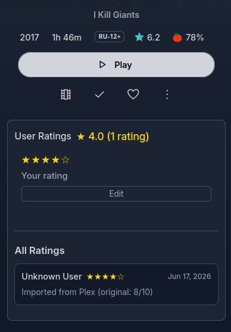

# Jellyfin User Ratings Plugin

**Rate and review content with other users on your Jellyfin server**

[](https://opensource.org/licenses/MIT)
[](https://jellyfin.org/)

A social rating system for Jellyfin. Rate movies, TV shows, and episodes, then browse what other users on your server think. Includes Plex rating import with scheduled auto-sync, provider ID-based self-healing, database health checks, and automatic backups.

---

## Screenshots

> Screenshots taken using the [ElegantFin](https://github.com/lscambo13/ElegantFin) theme. On the default Jellyfin theme, UI elements use Jellyfin's native styling.

### Rating Widget (collapsed)


### Rating Widget (expanded)


### Viewer Ratings Dashboard


### Settings — Backup, Health, Plex Import


### Rating Popup with Half-Star Precision


### Mobile Browser


---

## Features

- Rate any content 1-5 stars with optional notes
- View ratings and reviews from all users on your server
- Average ratings with total rating counts
- **Viewer Ratings Page** — dedicated browsing interface with:
  - Recently Rated sections (Movies, Shows, Episodes)
  - Unrated Watched Items — find content you've watched but haven't rated
  - Paginated "All Rated Items" with type filter and 8 sort options
  - Smart image fallback (Thumb → Backdrop → Primary)
- **Plex Rating Import** — import existing Plex ratings with real-time progress
  - Scheduled auto-sync to keep ratings up to date
  - Encrypted token storage (AES-256-CBC)
- **Provider ID Resolution** — ratings matched by ItemId first, then IMDB/TMDB/TVDB
- **Self-Healing** — stale ItemIds automatically re-keyed via provider IDs
- **Database Health Check** — check, heal, and clear stale ratings
- **Automatic Backups** — scheduled with configurable interval and retention
- **Backup File Management** — download, restore, delete, and upload backups
- Fail-safe loading — malformed entries skipped, not fatal

## Installation

1. **Dashboard** → **Plugins** → **Repositories**
2. Add repository URL:
   ```
   https://raw.githubusercontent.com/illmouse/Jellyfin.Plugin.UserRating/main/manifest.json
   ```
3. Go to **Catalog**, find **User Ratings**, and install
4. Restart Jellyfin

## Usage

The ratings UI appears automatically on item detail pages after installation.

**Rating:** Open any movie, TV show, or episode → scroll down → click stars → optionally add a note → Save.

**Browsing:** Dashboard → Plugins → User Ratings → View Ratings. Browse Recently Rated, Unrated Watched, or All Rated Items with filtering and sorting.

## Configuration

**Dashboard** → **Plugins** → **User Ratings** → **Settings**

### General

- **Recently Rated Items Count** (5-50, default: 10) — items per Recently Rated section

### Database Backup

- **Enable Automatic Backup** (default: on) — timestamped JSON backups on schedule
- **Backup Interval** (default: 24h) — how often to create backups
- **Max Backups to Keep** (default: 7) — oldest deleted when exceeded
- **Backup Directory Path** — where backups are stored (default: `/config/data/data/backups/UserRatings/`)
- **Create Backup Now** — manual immediate backup
- **Download / Restore / Delete / Upload** — manage individual backup files

### Database Health

- **Check Database Health** — scans all ratings, reports OK / Recoverable / Stale counts
- **Heal Database** — re-keys recoverable ratings to correct ItemIds via provider IDs
- **Clear Stale Ratings** — permanently removes orphaned ratings (Danger Zone)

### Plex Rating Import

1. Enter your **Plex Server URL** (e.g., `http://192.168.1.100:32400`)
2. Enter your **Plex Token** ([how to find it](https://www.plexopedia.com/plex-media-server/general/plex-token/))
3. Select target Jellyfin user and conflict mode (Skip / Overwrite / Keep Higher)
4. Click **Import** — watch real-time progress with matched/skipped/unmatched counts

**Automatic Sync:** Enable scheduled sync with configurable interval and user. Runs via Jellyfin's scheduled task system.

Items are matched using provider IDs (IMDB → TMDB → TVDB). Plex's 10-point scale converts to Jellyfin's 5-star scale. Series-level ratings are imported; individual episode ratings are skipped.

## Changelog

See [CHANGELOG.md](CHANGELOG.md).

## License

MIT License — see [LICENSE](LICENSE).

---

Made for the Jellyfin community